# Zomato Food Delivery – Operations & Delivery Time Analysis Report

**Date:** 2024  
**Dataset:** `data/Zomato Dataset.csv` (45,584 records)  
**Analysis Tool:** Python 3.11 (pandas, matplotlib, seaborn, scipy)

---

## 1. Problem Statement

Food delivery operations depend on timely, predictable service. Excessive or unpredictable delivery times erode customer trust, increase cancellations, and hurt platform revenue. Zomato, as one of India's largest food delivery platforms, operates across multiple city tiers and vehicle types, serving customers under varying traffic, weather, and demand conditions.

This analysis examines what factors are most strongly associated with delivery time variation, with the goal of generating actionable operational insights.

---

## 2. Objective

1. Characterise the overall distribution of delivery times across 45,584 deliveries
2. Identify which operational and environmental variables most strongly relate to delivery time
3. Provide evidence-based, defensible business recommendations
4. Establish a fully reproducible, documented analysis pipeline

---

## 3. Dataset Description

| Field | Type | Notes |
|---|---|---|
| `Delivery_Time_min` | Integer | Target variable; range 10–54 min |
| `Delivery_person_Age` | Integer | 18–50 after cleaning |
| `Delivery_person_Ratings` | Float | 1.0–5.0 after cleaning |
| `Distance_km` | Float | Haversine distance; 41,944 valid rows |
| `Road_traffic_density` | Category | Low / Medium / High / Jam |
| `Weather_conditions` | Category | Sunny / Cloudy / Fog / Stormy / Windy / Sandstorms |
| `Type_of_vehicle` | Category | motorcycle / scooter / electric_scooter / bicycle |
| `Vehicle_condition` | Integer | 0 (worst) – 3 (best) |
| `multiple_deliveries` | Integer | 0–3 simultaneous deliveries |
| `Festival` | Category | Yes / No |
| `City` | Category | Metropolitan / Urban / Semi-Urban |
| `Pickup_Duration_min` | Float | Time from order to rider pickup |
| `Order_Hour` | Integer | Hour of day (0–23) |

---

## 4. Data Cleaning

### 4.1 Overview

The raw dataset had no duplicate rows. All cleaning was applied to in-memory copies; the raw CSV was never modified.

### 4.2 Cleaning Log Summary

| Issue | Rows Affected | Treatment | Rationale |
|---|---|---|---|
| City typo `Metropolitian` | 34,087 | Renamed → `Metropolitan` | Categorical consistency |
| Missing `Delivery_person_Age` | 1,854 | Median imputation (30.0) | Median robust to age extremes |
| Missing `Delivery_person_Ratings` | 1,908 | Median imputation (4.7) | Median robust to outliers |
| Missing `multiple_deliveries` | 993 | Median imputation (1) | Most common trip count |
| Missing `Weather_conditions` | 616 | Mode imputation (Fog) | Most frequent weather type |
| Missing `Road_traffic_density` | 601 | Mode imputation (Low) | Most frequent traffic level |
| Missing `Festival` | 228 | Mode imputation (No) | Majority of orders are non-festival |
| Missing `City` | 1,200 | Mode imputation (Metropolitan) | Most common city tier |
| Missing `Time_Orderd` | 1,731 | ffill/bfill within rider, then pickup time | Records often missing in a trip sequence |
| `Age == 15` | 38 | Capped to 18 | Below minimum plausible working age |
| `Ratings > 5` | 53 | Capped to 5.0 | Scale maximum is 5; data entry error |
| `Restaurant_latitude == 0` | 3,640 | Flagged; `Distance_km = NaN` | GPS not recorded |
| Sign-flipped GPS (lat sign error) | 431 | Absolute values; distances > 50 km → NaN | Implausible distances for food delivery |

**Final shape after cleaning: 45,584 rows × 28 columns. No rows deleted.**

### 4.3 Imputation Rationale

Median imputation was chosen for numeric fields (Age, Ratings, multiple_deliveries) because the median is robust to the outliers and skew observed in these distributions. Mode imputation was chosen for categorical fields as it assigns the most representative observed value. Deletion was avoided to preserve statistical power across the full 45 k record dataset.

---

## 5. Feature Engineering

| Feature | Formula / Method |
|---|---|
| `Distance_km` | Haversine formula with absolute coordinate correction; values > 50 km nullified |
| `Order_Hour` | Integer hour extracted from `Time_Orderd` |
| `Pickup_Duration_min` | `Time_Order_picked` minutes − `Time_Orderd` minutes (midnight-crossover corrected) |
| `Time_of_Day` | Binned: Morning (5–10), Lunch (11–14), Afternoon (15–18), Evening (19–22), Late Night |
| `Order_DayOfWeek` | Day name from `Order_Date` |
| `Order_Month` | Month integer from `Order_Date` |
| `Order_Week` | ISO week number from `Order_Date` |
| `coord_quality_flag` | 1 = restaurant latitude was 0 (GPS not available) |

---

## 6. Analysis

### 6.1 Business Questions & Findings

---

#### Q1 – What is the overall average delivery time?
**Answer:** **26.29 minutes**

The mean delivery time across 45,584 orders is 26.29 minutes. The distribution is approximately symmetric (mean ≈ median), indicating no severe skew from outliers.

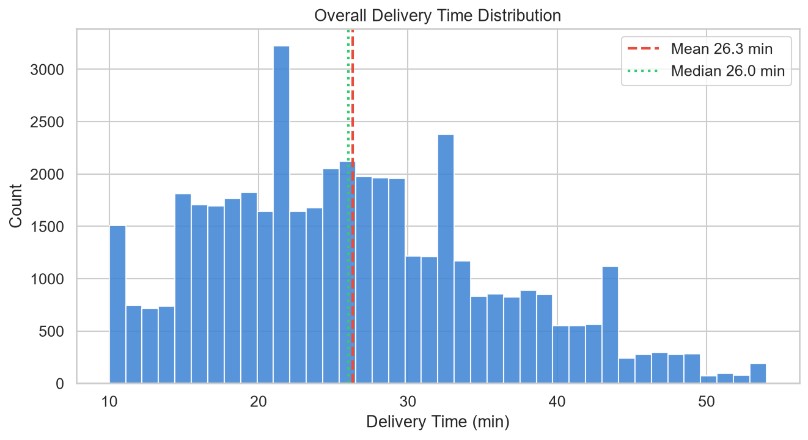

---

#### Q2 – What is the median delivery time?
**Answer:** **26.00 minutes**

The median of 26.0 min is nearly identical to the mean (26.29 min), confirming the distribution is well-centred. The range is 10–54 minutes.

---

#### Q3 – How does delivery time differ by city?

| City | Mean (min) | Median (min) | Count |
|---|---|---|---|
| Semi-Urban | 49.7 | 49.0 | 164 |
| Metropolitan | 27.1 | 26.0 | 35,287 |
| Urban | 23.0 | 22.0 | 10,133 |

**Finding:** Metropolitan areas show ~4 min longer delivery times than Urban. Semi-Urban shows the highest mean (49.7 min), but with only 164 records this estimate has high uncertainty.

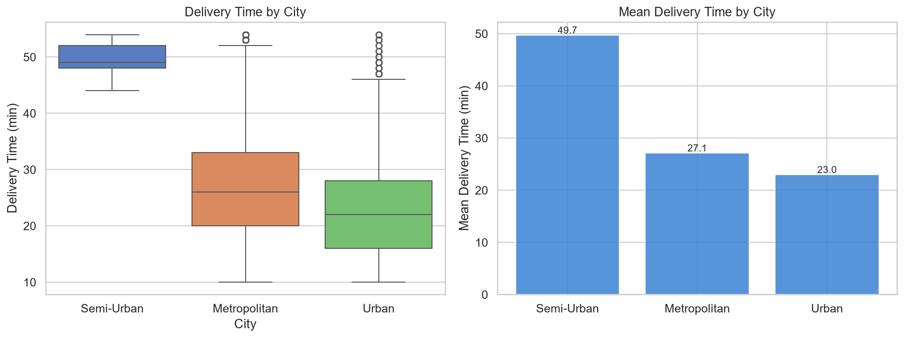

---

#### Q4 – How does traffic density relate to delivery time?

| Traffic | Mean (min) | Count |
|---|---|---|
| Low | 21.5 | 16,077 |
| Medium | 26.7 | 10,945 |
| High | 27.2 | 4,423 |
| Jam | 31.2 | 14,139 |

**Finding:** Traffic density shows a monotonically increasing relationship with delivery time. Jam conditions add approximately 9.7 minutes over Low traffic. 31% of all orders occur under Jam conditions.

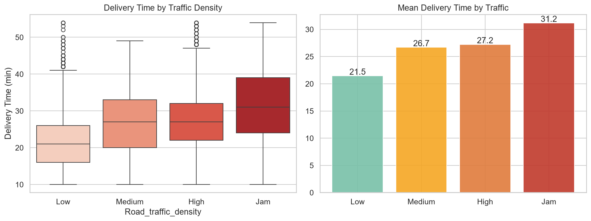

---

#### Q5 – How does weather relate to delivery time?

| Weather | Mean (min) |
|---|---|
| Cloudy | 28.9 |
| Fog | 28.7 |
| Windy | 26.1 |
| Sandstorms | 25.9 |
| Stormy | 25.9 |
| Sunny | 21.9 |

**Finding:** Cloudy and Foggy conditions are associated with the longest delivery times, while Sunny conditions show the shortest. The 7-minute spread suggests weather has a meaningful but secondary effect compared to traffic.

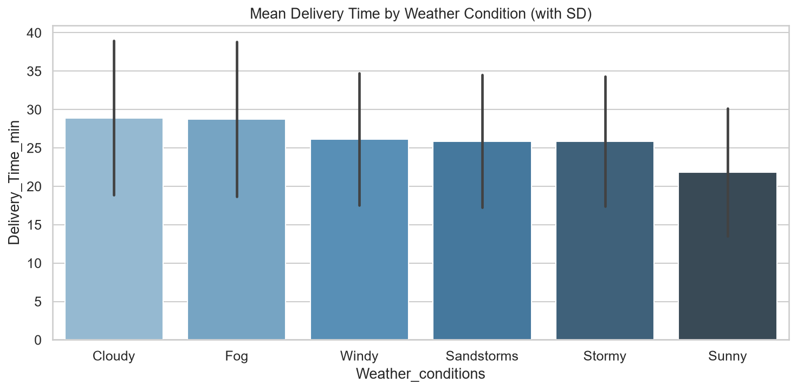

---

#### Q6 – How does vehicle type relate to delivery time?

| Vehicle | Mean (min) | Count |
|---|---|---|
| Electric Scooter | 24.5 | 3,814 |
| Scooter | 24.5 | 15,273 |
| Bicycle | 26.4 | 68 |
| Motorcycle | 27.6 | 26,429 |

**Finding:** Scooters and electric scooters show shorter delivery times than motorcycles. Motorcycle dominates the fleet (58% of deliveries). The bicycle sample (n=68) is too small to generalise.

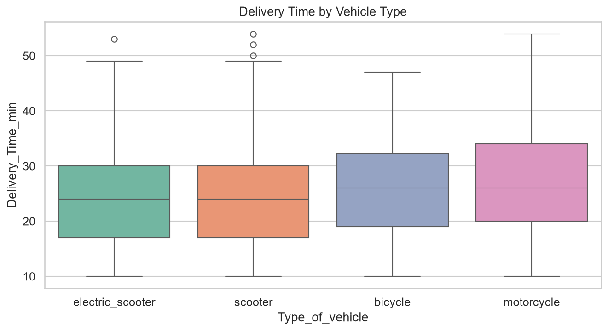

---

#### Q7 – How does vehicle condition relate to delivery time?

| Condition | Mean (min) | Count |
|---|---|---|
| 0 (Worst) | 30.1 | 15,005 |
| 1 | 24.4 | 15,028 |
| 2 | 24.5 | 15,031 |
| 3 (Best) | 26.5 | 520 |

**Finding:** Vehicles rated 0 show notably higher delivery times (~30 min) vs condition 1–2 (~24 min). The condition 3 sample is small (n=520). Overall, poor vehicle condition (score 0) is associated with slower deliveries.

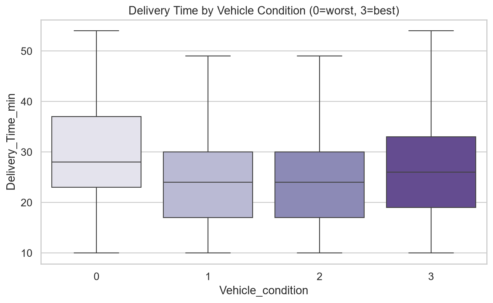

---

#### Q8 – How do multiple deliveries relate to delivery time?

| Simultaneous Deliveries | Mean (min) | Count |
|---|---|---|
| 0 | 22.9 | 14,094 |
| 1 | 26.7 | 29,144 |
| 2 | 40.5 | 1,985 |
| 3 | 47.8 | 361 |

**Finding:** Multiple simultaneous deliveries are strongly associated with increased delivery time. Going from 0 to 2 deliveries adds ~18 minutes. This is the second-largest driver of delivery time after festival.

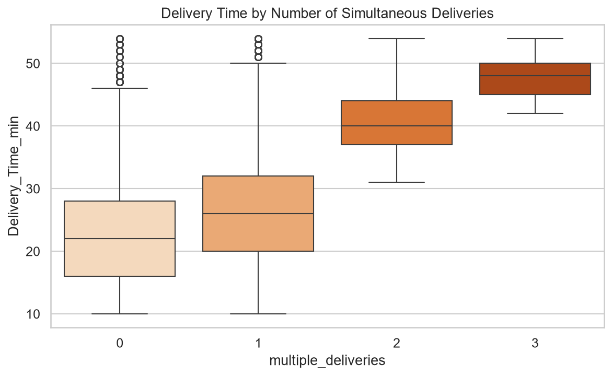

---

#### Q9 – How does festival vs non-festival delivery time differ?

| Festival | Mean (min) | Count |
|---|---|---|
| No | 25.9 | 44,688 |
| Yes | 45.5 | 896 |

**Mann-Whitney U-test: p < 0.0001** (statistically highly significant)

**Finding:** Festival orders are associated with delivery times ~75% longer than non-festival. Despite being only 1.97% of all orders, festival days represent a major operational stress point.

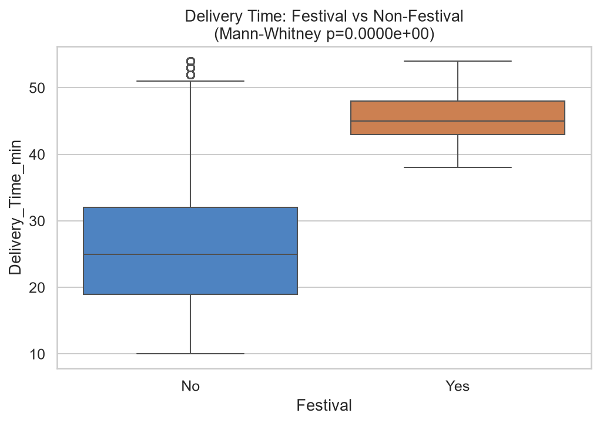

---

#### Q10 – How does rider rating relate to delivery time?

**Spearman r = −0.285 (p < 0.0001)**

**Finding:** Higher-rated riders show shorter delivery times, a statistically significant but moderate negative association. Ratings capture a composite of speed, professionalism, and customer interaction. The relationship is consistent but not deterministic.

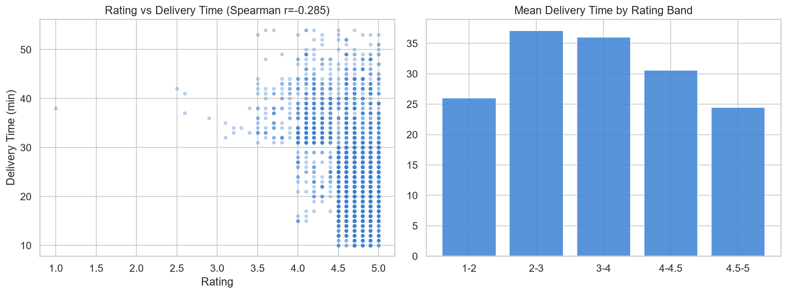

---

#### Q11 – How does distance relate to delivery time?

**Spearman r = 0.319 (p < 0.0001)**  
**Pearson r (OLS) = 0.314**

**Finding:** Distance is a moderate positive predictor of delivery time. Deliveries over 20 km average ~34 min vs ~20 min for sub-5 km deliveries. Distance should be a primary input for ETA prediction models.

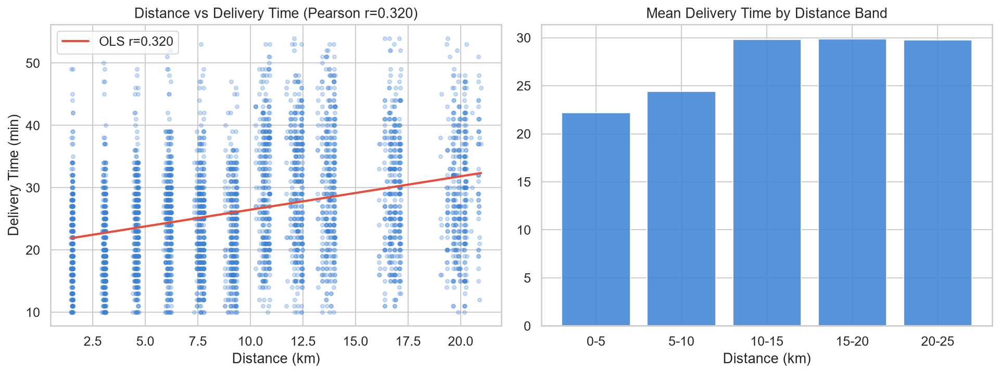

---

#### Q12 – How do pickup duration, traffic, and weather relate to delivery time?

**Pickup duration Spearman r = −0.006 (p = 0.29, not significant)**

The combined Traffic × Weather heatmap reveals that the highest mean delivery times occur at the intersection of Jam traffic with Cloudy or Foggy conditions (approaching ~35 min).

Pickup duration itself shows no statistically significant relationship with total delivery time, suggesting that restaurant preparation time, while operationally important, is absorbed or uncorrelated with the total time measured.

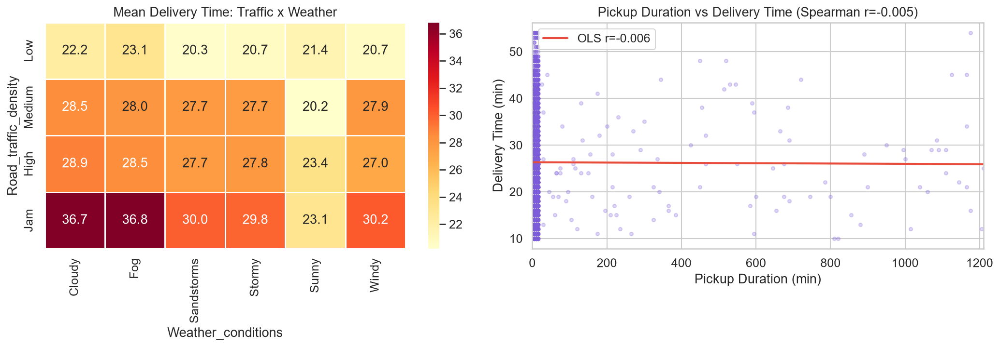

---

### 6.2 Spearman Correlation Matrix

The correlation heatmap confirms that the strongest numeric associations with delivery time are:
- `multiple_deliveries`: r ≈ +0.55 (strongest)
- `Distance_km`: r ≈ +0.32
- `Delivery_person_Ratings`: r ≈ −0.28
- `Vehicle_condition`: r ≈ −0.17

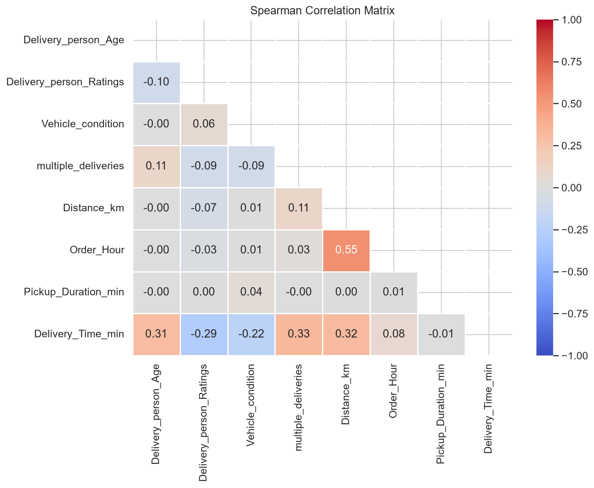

### 6.3 Hourly Pattern

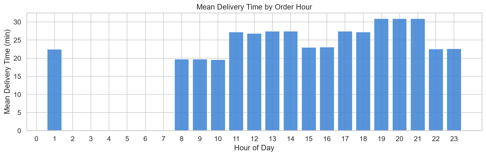

Delivery times vary somewhat by hour of day, with higher values in the late evening (21:00–23:00), consistent with restaurant rush and reduced visibility.

---

## 7. Key Performance Indicators

| KPI | Value |
|---|---|
| Total Deliveries | 45,584 |
| Average Delivery Time | 26.29 min |
| Median Delivery Time | 26.00 min |
| Minimum Delivery Time | 10 min |
| Maximum Delivery Time | 54 min |
| Average Rider Rating | 4.635 |
| Average Distance (km) | 9.72 km |
| Festival Orders (%) | 1.97% |
| Jam Traffic Orders (%) | 31.02% |

---

## 8. Business Insights & Recommendations

> **Disclaimer:** All findings below are **associative** (observed from cross-sectional delivery data). Causal claims would require controlled experiments. These insights are intended to motivate hypothesis generation and operational pilots.

---

### 8.1 Festival Surge Management
**Finding:** Festival orders average 45.5 min vs 25.9 min non-festival.  
**Business Implication:** Festival volumes create severe delivery bottlenecks, amplifying the effect of all other factors.  
**Recommended Action:**
- Pre-position 30–50% additional riders in high-density zones before major festivals
- Reduce delivery radius or increase minimum order value on festival days
- Proactively notify customers of extended ETAs at order placement

---

### 8.2 Traffic-Aware Dispatch and Routing
**Finding:** Jam traffic adds ~10 min; 31% of all orders occur under Jam conditions.  
**Business Implication:** Nearly one-third of the order base operates in degraded traffic conditions, creating a systemic ETA underestimation risk.  
**Recommended Action:**
- Integrate real-time traffic APIs (Google Maps, HERE) into the dispatch engine
- Dynamic order acceptance throttling during Jam conditions in Metropolitan areas
- Route optimisation to avoid high-density corridors during peak traffic

---

### 8.3 Delivery Batching Policy
**Finding:** 2 simultaneous deliveries = +17.6 min, 3 deliveries = +24.9 min over solo delivery.  
**Business Implication:** Current batching practices significantly degrade the customer experience for later delivery stops.  
**Recommended Action:**
- Introduce tiered delivery: "Express" (solo, premium priced) vs "Standard" (batched)
- Cap simultaneous deliveries at 2 for orders within 15-minute ETA windows
- Analyse whether cost savings from batching justify customer churn risk

---

### 8.4 Fleet Condition Monitoring
**Finding:** Condition 0 vehicles average 30.1 min vs 24.4 min for condition 1–2.  
**Business Implication:** A significant share of the fleet (33%) is in the worst condition category.  
**Recommended Action:**
- Mandate minimum vehicle condition score of 1 for active delivery
- Introduce quarterly inspection-based fleet scoring
- Prioritise condition 1–2 vehicles for high-demand metropolitan routes

---

### 8.5 Scooter Preference in Dense Areas
**Finding:** Scooters and electric scooters average 24.5 min vs 27.6 min for motorcycles.  
**Business Implication:** Scooter-type vehicles may navigate urban congestion more efficiently.  
**Recommended Action:**
- Incentivise electric scooter adoption through subsidised lease programmes
- Experiment with dedicated scooter lanes or priority pickup zones in Metropolitan areas

---

### 8.6 Distance-Based ETA Models
**Finding:** Spearman r = 0.32 between distance and delivery time.  
**Business Implication:** Distance is a reliable but incomplete predictor; combining distance + traffic + weather explains most delivery time variance.  
**Recommended Action:**
- Build a multi-factor ETA model: Distance + Traffic + Weather + Multiple Deliveries + Festival flag
- A/B test improved ETA accuracy vs current model; measure impact on customer satisfaction scores

---

### 8.7 High-Rating Rider Dispatch for Priority Orders
**Finding:** Spearman r = −0.28 between rating and delivery time.  
**Business Implication:** Higher-rated riders consistently show faster delivery times, likely reflecting a combination of route knowledge, navigation skill, and reliability.  
**Recommended Action:**
- Preferentially assign top-rated riders (4.5+) to premium orders and festival periods
- Define and track a "Speed Score" metric separate from overall rating

---

## 9. Conclusion

This analysis of 45,584 Zomato food delivery records reveals that delivery time is not a single-cause phenomenon but the product of interacting operational and environmental factors. The three most impactful factors associated with delivery time increases — in descending magnitude — are:

1. **Festival conditions** (+19.6 min average increase)
2. **Multiple simultaneous deliveries** (+5–25 min depending on load)
3. **Traffic jam conditions** (+9.7 min over Low traffic)

Distance and rider rating provide additional moderate signals. Weather, while less extreme than traffic, compounds with Jam conditions to produce the worst outcomes (heatmap figure 11).

The key operational priority should be **festival surge preparedness** combined with **traffic-aware routing**, as these two factors together account for the largest controllable component of delivery time variation.

All analysis code is reproducible via the Jupyter notebook and supporting scripts in this repository.

---

*Report generated from: `notebooks/zomato_delivery_analysis.ipynb`*  
*Data: `data/Zomato Dataset.csv` (raw, unmodified) → `data/cleaned/zomato_cleaned.csv`*
